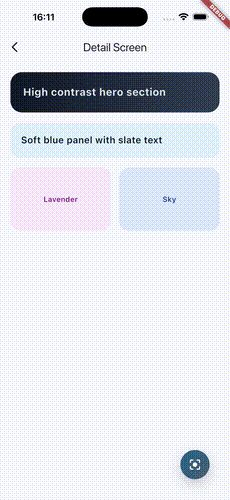
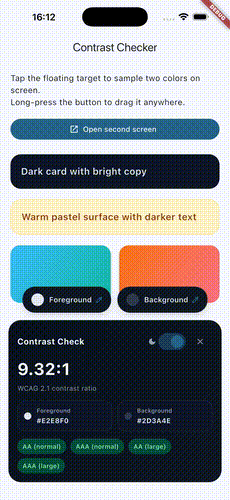

# Check contrast anywhere in the app

Overlay contrast checker for Flutter apps. It shows a draggable floating button; tapping it reveals two color pickers (powered by [eye_dropper](https://pub.dev/packages/eye_dropper)) and a modern WCAG contrast card. Close the card to return to the floating button.

<div align="center">
  
  
</div>

## Features

- Always-on draggable overlay trigger (long-press to reposition)
- Dual pickers with lens buttons for foreground and background colors
- WCAG 2.1 contrast ratio + AA/AAA badges for normal/large text

## Getting started

Add the dependency:

```yaml
dependencies:
  flutter_contrast_checker: ^0.1.0
```

Minimum supported Flutter SDK is `>=3.10.4`.

## Usage

Wrap your app (or any subtree) with the overlay:

```dart
import 'package:flutter/material.dart';
import 'package:flutter_contrast_checker/flutter_contrast_checker.dart';

class MyApp extends StatelessWidget {
  const MyApp({super.key});

  @override
  Widget build(BuildContext context) {
    return MaterialApp(
      home: ContrastCheckerOverlay(
        child: Scaffold(
          appBar: AppBar(title: const Text('Contrast Demo')),
          body: const Center(child: Text('Tap the floating button')),
        ),
      ),
    );
  }
}
```

### Using `MaterialApp.builder` (global overlay)

```dart
return MaterialApp(
  builder: (context, child) => ContrastCheckerOverlay(child: child!),
  home: const HomeScreen(),
);
```

### Initial colors

```dart
ContrastCheckerOverlay(
  initialForeground: Colors.black,
  initialBackground: Colors.white,
  child: child,
);
```

## Contributing

Contributions are welcome. Please open an issue or a pull request.

## License

MIT. See `LICENSE`.
